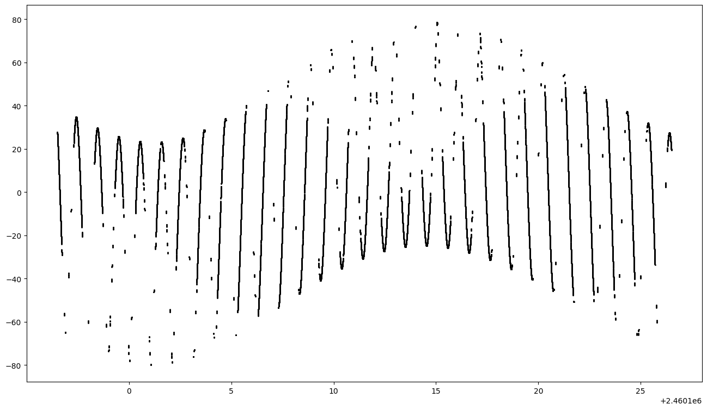

# The Basics

In this example, we are going to process ECSV monthly files from stas289 TESS-W photometer.
Some examples of basic AstroPy tables usage is shown below.

But first, we need to import several packages and objects.


```python
import os
import matplotlib as mpl
import matplotlib.pyplot as plt
import astropy.units as u

from astropy.timeseries import TimeSeries
from tess.ida.constants import TESSW_COLS as TW, TIMESERIES_COLS as TS, IDA_KEYWORDS as IKW

FILE_TO_PROCESS = os.path.join('ECSV', 'stars289', 'since_2019-05_until_2023-06.ecsv')
```


```python
print(FILE_TO_PROCESS)
```

    ECSV/stars289/since_2019-05_until_2023-06.ecsv


We load this file as a TimeSeries AstroPy Table. TimeSeries tables have a special first column named `time` and also have additional methods for processing. See the [AstroPy documentation](https://docs.astropy.org/en/stable/timeseries/index.html) for more details.

Note that the format is always `ascii.ecsv`


```python
table = TimeSeries.read(FILE_TO_PROCESS, format='ascii.ecsv', delimiter=',')
```

We can view the table general structure by typing:


```python
table.info
```


    <TimeSeries length=18250>
             name          dtype    unit    class  
    --------------------- ------- ------- ---------
                     time  object              Time
    Enclosure Temperature float64   deg_C  Quantity
          Sky Temperature float64   deg_C  Quantity
                Frequency float64      Hz  Quantity
                     MSAS float64 mag(Hz) Magnitude
                       ZP float64            Column
          Sequence Number   int64            Column
                  Sun Alt float64     deg  Quantity
                 Moon Alt float64     deg  Quantity
               Moon Phase float64          Quantity
                     JDay float64            Column


The first column is always the `time` column and this is imposed by AstroPy.

Note that many of the columns have units attached to them. The column names are taken from the IDA files metadata (but not parsed!). They are inconvenient to work with and may be subject to change. To protect our code from this event we use Python constants (actually Python String enumerations). Here are the constants, as defined by the TESS-IDA-TOOLS package and imported in the header of this notebook:

```python
class TESSW_COLS(BaseEnum):
    UTC_TIME   = 'time' # always 'time' for TimeSeries Astropy Class
    LOCAL_TIME = 'Local Date & Time'
    BOX_TEMP   = 'Enclosure Temperature'
    SKY_TEMP   = 'Sky Temperature'
    FREQ1      = 'Frequency'
    MAG1       = 'MSAS'
    ZP1        = 'ZP'
    SEQ_NUM    = 'Sequence Number'

class TIMESERIES_COLS(StrEnum):
    SUN_ALT    = 'Sun Alt'
    MOON_ALT   = 'Moon Alt'
    MOON_PHASE = 'Moon Phase'
```

We can access the frequency column or the Sun altitude of the first row in the time series as:


```python
table[TW.FREQ1][0]
```


$7.64 \; \mathrm{Hz}$


```python
table[TS.SUN_ALT][0]
```


$-29.827946\mathrm{{}^{\circ}}$


Metadata imported from the IDA files are available in the `meta` attribute of the table. We have also defined symbolic names for a subset of these IDA keywords like this:
```python
class IDA_KEYWORDS(StrEnum):
    LICENSE      = 'License'
    NUM_HEADERS  = 'Number of header lines'
    NUM_CHANNELS = 'Number of channels'
    OBSERVER     = 'Data supplier'
    LOCATION     = 'Location name'
    POSITION     = 'Position'
    FOV          = 'Field of view'
    COVER_OFFSET = 'TESS cover offset value'
    NUM_COLS     = 'Number of fields per line'
    ZP           = 'TESS zero point'
    AIM          = 'Measurement direction per channel'
    FILTERS      = 'Filters per channel'
    PHOT_NAME    = 'Instrument ID'
```


```python
table.meta['ida']
```


    {'Data supplier': {'affiliation': 'Astrocamp', 'observer': 'Agustín Nuñez'},
     'Device type': 'TESS-W',
     'Field of view': 17.0,
     'Filters per channel': 'None',
     'Instrument ID': 'stars289',
     'License': 'ODbL 1.0 http://opendatacommons.org/licenses/odbl/summary/',
     'Local timezone': 'Europe/Madrid',
     'Location name': {'country': '- Astrocamp',
      'place': 'Nerpio',
      'region': 'Spain',
      'sub_region': 'Castile-La Mancha',
      'town': 'Albacete'},
     'Measurement direction per channel': {'azimuth': 0.0, 'zenital': 0.0},
     'Moving / Fixed look direction': 'FIXED',
     'Moving / Stationary position': 'STATIONARY',
     'Number of channels': 1,
     'Number of fields per line': 8,
     'Number of header lines': 35,
     'Position': {'height': 0.0, 'latitude': 38.1657813, 'longitude': -2.3268926},
     'TESS MAC address': '5C:CF:7F:76:60:EC',
     'TESS cover offset value': 0.0,
     'TESS firmware version': '1.0',
     'TESS zero point': 20.45,
     'Time Synchronization': 'timestamp added by MQTT subscriber',
     'URL': 'http://www.darksky.org/NSBM/sdf1.0.pdf'}


To access the position, just type:


```python
table.meta['ida'][IKW.POSITION]
```


    {'height': 0.0, 'latitude': 38.1657813, 'longitude': -2.3268926}


```python
table.meta['ida'][IKW.POSITION]['latitude']
```


    38.1657813


Note that metadata has not associated AstroPy units, but we can add on the fly in our code:


```python
table.meta['ida'][IKW.POSITION]['latitude'] * u.deg
```


$38.165781\mathrm{{}^{\circ}}$


We can also add new columns on the fly to the table. The processing is done for all rows. For instance, to add a Julian Day column to our TimeSeries:


```python
table['JDay'] = table['time'].jd
table['JDay'][0]
```


    2460096.5004282407


## Plotting


```python
figura = plt.figure(figsize=(16, 9))
ax1=figura.add_subplot(111)

plt.plot(table['JDay'],table[TS.MOON_ALT],'ko',ms=1)
```


    [<matplotlib.lines.Line2D at 0x742414c36380>]


    

    


```python

```
